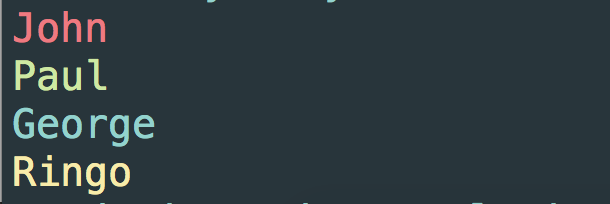
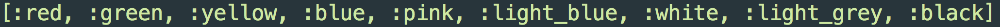
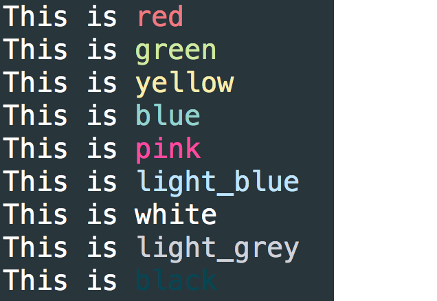

# colorizr - Udacity Ruby Nano Degree

colorizr allows you to quickly and easily colorize terminal output

# Install

To get access to the gem inside of your applications, run the following from your command line.

`$ gem install colorizr-1.0.0.gem`

Then require it and you're ready to colorize!

`require 'colorizr'`

# Usage

### Use colorizr as follows

```
puts "John".red
puts "Paul".green
puts "George".blue
puts "Ringo".yellow
```



### To get an array of all the color options

`p String.colors`



### To see a sample of each color

`String.sample_colors`



# License

colorizr may be redistributed under the MIT [license](https://opensource.org/licenses/MIT)
